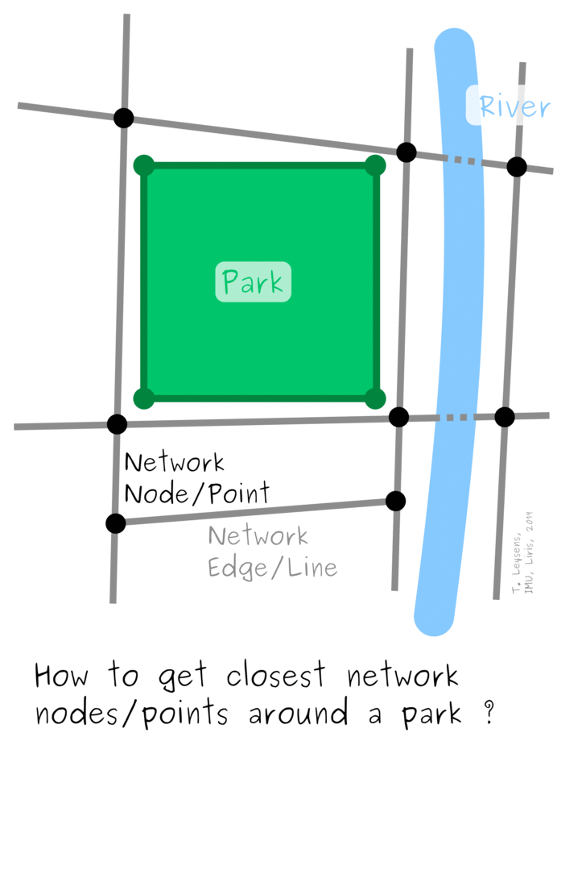
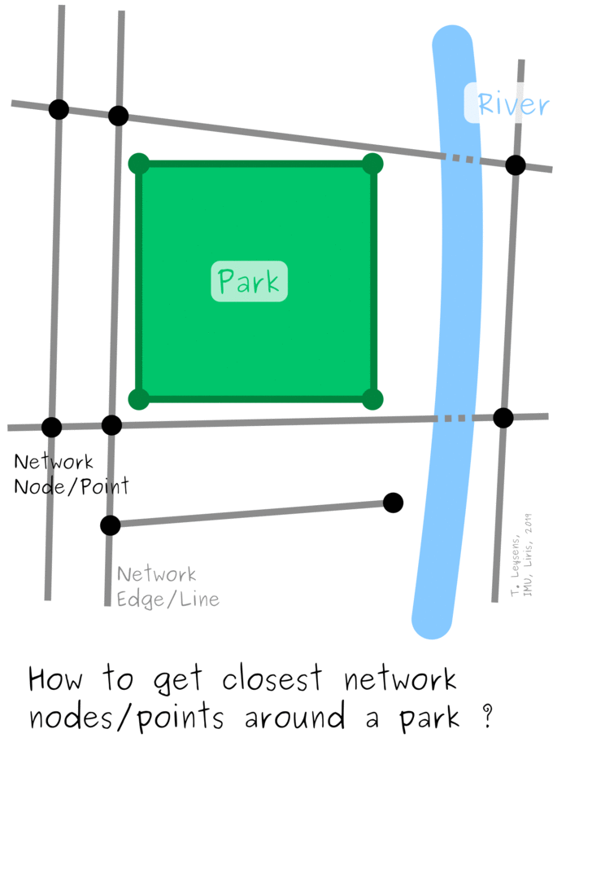
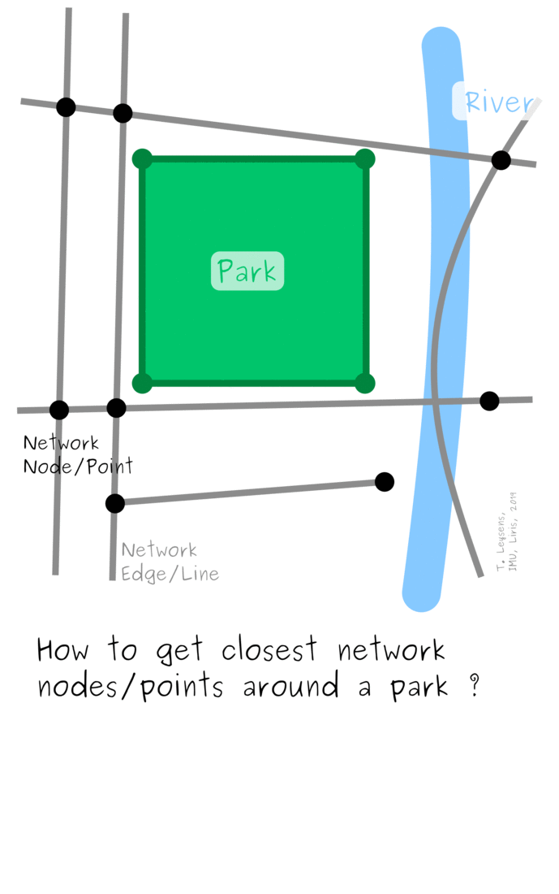
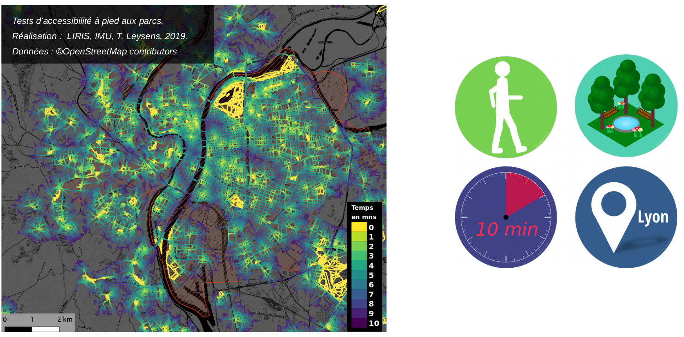

## Presentation

This docker (*based as the others on geodecision package*):
* measures accessibility:
    * from polygons (*origins, get points from contours*)
    * with as set speed
    * with a set of durations
    * on a network
* creates isolines and isochrones
* returns spatial results files (*GeoJSON/GPKG/Shapefiles*)

## Methodological approach
Here is a brief history of our reflexions and methodolical approaches to connect the parks to the street network.

| Name | Illustration | Details & Limits | Status |
|:-----|:------------:|:---------------:|:------:|
| V1 | | Slow (*lot of spatial requests*), arbitrary buffer size, problematic with very long edges | *Rejected* |
| V2 | | Generates a lot of points, must be adapted regarding the size of the park | *Rejected* |
| V3 |  | Better than the previous solution but may generate unnecessary nodes and edges | *Rejected* |
| V4 |  | Demands a more complicated implementation but is more efficient and precise | *Adopted* |



## Configuration table
> *This table explains the ```config.json``` file*

| name | type | description | example |
|:-----|:----:|:------------|:-------:|
| ***polygons_geojsonfile*** | str | Input polygons filepath | *"./data/Accessibility/parks.geojson"*|
| ***graph_nodes_jsonfile*** | str | Input JSON nodes filepath | *"./data/Accessibility/nodes.json"*|
| ***graph_edges_jsonfile*** | str | Input JSON edges filepath | *"./data/Accessibility/parks.json"*|
| ***epsg_graph*** | int | EPSG of graph | *4326*|
| ***epsg_input*** | int | EPSG of outputs | *2154*|
| ***epsg_metric*** | int | Metric EPSG (*for precise distance calculations*) | *2154*|
| ***output_isolines_layername*** | str | Name of the isolines layer | *"isolines"*|
| ***output_buffered_isolines_layername*** | str | Name of the buffered isolines layer | *"buffered_isolines"*|
| ***output_buffered_isolines_union_layername*** | str | Name of the buffered isolines union layer | *"buffered_isolines_union"*|
| ***output_folder*** | str | Path to outputs folder | *"./data/outputs"*|
| ***output_format*** | str | Format of the output (*"geojson" or "geopackage"*) | *"geopackage*|
| ***trip_times*** | array | List of desired durations | *[1,2,3,4,5,6,7,8,9,10]*|
| ***threshold*** | str | Max length (in meters) of a POI connection edge, POIs with connection edge beyond this length will be removed. | *20*|
| ***dist_split*** | int | Distance in meters to split polygons' contour linestrings to create new origins points | *100*|
| ***knn*** | int | k nearest neighbors to query for the nearest edge.
Consider increasing this number up to 10 if the connection output is slightly unreasonable. But higher knn number will slow down the process (*see geodecision.graph documentation*) | *5*|
| ***distance*** | str | Distance reachable in 60 minutes in meters (*used to set speed*) | *5000*|
| ***access_type*** | str | Type of polygon that have to be connected to the network | *"park"*|
| ***weight*** | str | Name of the weight column in data | *"time"*|
| ***prefix*** | str | Prefix for the name of new nodes and edges files | *edges.json*|
| ***columns_to_keep*** | array | List of columns name (*columns that will be kept*), Default: []. If default, keep all columns but geometry column other than Points | *["name", "id", "geometry"]*|
| ***id_column*** | str | Name of the column with unique id for each polygon | *"id"*|
| ***distance_buffer*** | real | Value in meters for buffering isolines | *40*|
| ***tolerance*** | real | Tolerance used in possible simplification if <0, default: 0 | *10*|
| ***lat*** | str | name of field with latitude coordinates in network nodes file | *"x"*|
| ***lon*** | str | name of field with longitude coordinates in network nodes file | *"y"*|


## Inputs/Outputs
* **Input**:
    * ```config.json```:
        * *example*:
            ```JSON
            {
            	"polygons_geojsonfile" : "./data/Accessibility/parks.geojson",
            	"graph_nodes_jsonfile" : "./data/Accessibility/nodes.json",
            	"graph_edges_jsonfile" : "./data/Accessibility/edges.json",
            	"epsg_graph" : 4326,
            	"epsg_input" : 2154,
            	"epsg_metric" : 2154,
            	"output_isolines_layername" : "isolines",
            	"output_buffered_isolines_layername" : "buffered_isolines",
            	"output_buffered_isolines_union_layername" : "buffered_isolines_union",
            	"output_folder" : "./data/outputs",
            	"output_format" : "geopackage",
            	"trip_times" : [1,2,3,4,5,6,7,8,9,10],
            	"threshold" : 20,
            	"dist_split" : 100,
            	"knn" : 5,
            	"distance" : 5000,
            	"access_type" : "park",
            	"weight" : "time",
            	"prefix" : "Lyon_area_parks",
            	"columns_to_keep" : ["name", "id", "geometry"],
            	"id_column" : "id",
            	"distance_buffer" : 40,
            	"tolerance" : 10,
            	"lat" : "x",
            	"lon" : "y"
            }
            ```
* **Outputs**:
    * geospatial files (*can be several GeoJSON files or one GPKG file with several layers regarding the "output format parameter"*):
        * isolines
        * buffered isolines
        * one file/layer per duration
    * graph files:
        * updated nodes JSON file
        * updated edges JSON file
    * possible errors:
        * problematic nodes JSON file

## Build
> *following command works inside the Dashboard/DockerContext directory*

```bash
sudo docker build --build-arg git_token=<TOKEN> -t accessibility <DockerContext>
```

## Run
> *following command works inside the Dashboard/ directory*

```bash
sudo docker run --mount src=`pwd`,target=/Input,type=bind --mount src=`pwd`,target=/Output,type=bind -it accessibility
```
