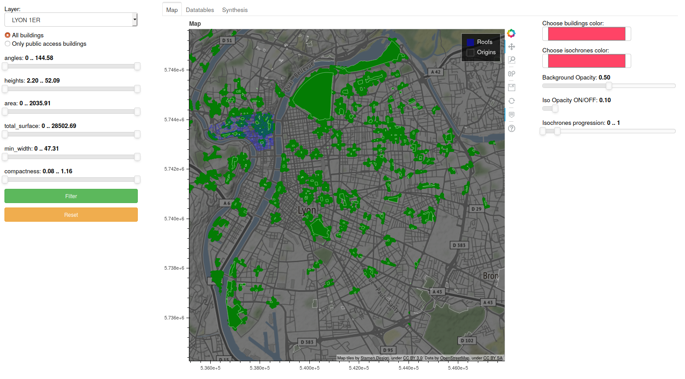

## Build
Build (*following command works inside the Dashboard/DockerContext directory*):
    ```bash
    sudo docker build --build-arg git_token=<TOKEN> -t dashboard_app DockerContext
    ```

## Run
Run => In order to get the Bokeh Dashboard app running in docker but stay accessible from the web browser host, ports need to be set with the ```-p``` argument (*following command works inside the Dashboard/ directory*) :
```bash
sudo docker run --mount src=`pwd`,target=/Input,type=bind,type=bind -p 5006:5006 -it dashboard_app
```
* Then, go to => http://localhost:5006/dashboard
* You should get something like this:

