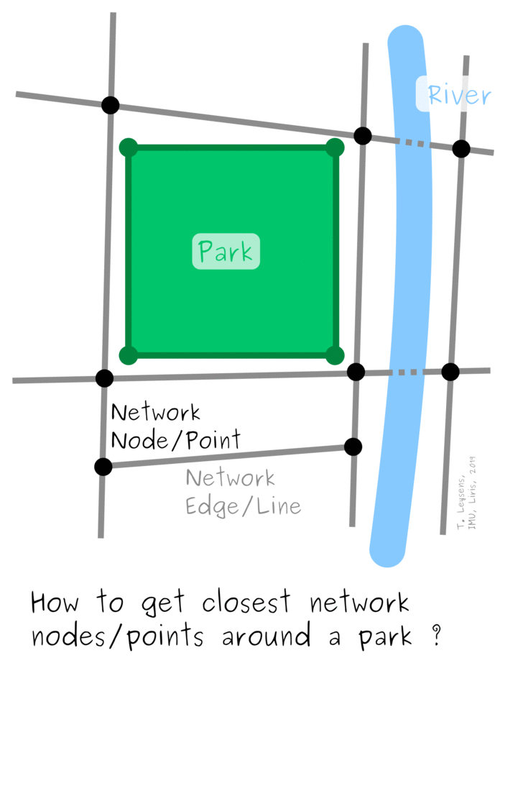
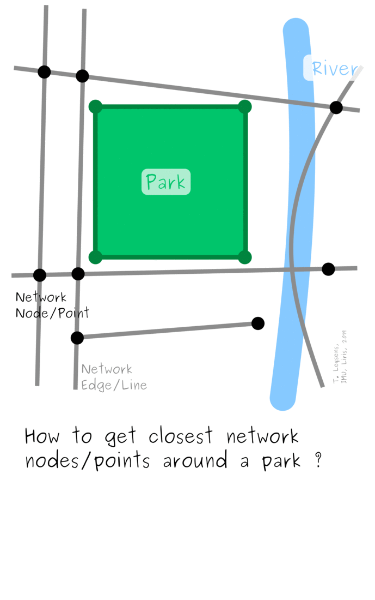

## Presentation

This docker (*based as the others on geodecision package*) can:
* generate graphs from OSM networks and connect polygons (*such as parks*) to the graph by adding nodes and edges.
* measure accessibility and generate isolines and isochrones geospatial data.

### Brief history of our reflexions regarding creation of new graph nodes and edges
Here is a brief history of our reflexions and methodolical approaches to connect the parks to the street network.

| Name | Illustration | Details & Limits | Status |
|:-----|:------------:|:---------------:|:------:|
| V1 | | Slow (*lot of spatial requests*), arbitrary buffer size, problematic with very long edges | *Rejected* |
| V2 | | Generates a lot of points, must be adapted regarding the size of the park | *Rejected* |
| V3 |  | Better than the previous solution but may generate unnecessary nodes and edges | *Rejected* |
| V4 |  | Demands a more complicated implementation but is more efficient and precise | *Adopted* |

## Short illustration of purposes


## Build
Build (*following command works inside the Dashboard/DockerContext directory*):
    ```bash
    sudo docker build --build-arg git_token=<TOKEN> -t roofs_analyse DockerContext
    ```

## Run
Run => In order to get the Bokeh Dashboard app running in docker but stay accessible from the web browser host, ports need to be set with the ```-p``` argument (*following command works inside the Dashboard/ directory*) :
```bash
sudo docker run --mount src=`pwd`,target=/Input,type=bind,type=bind -p 5006:5006 -it roofs_analyse
```
