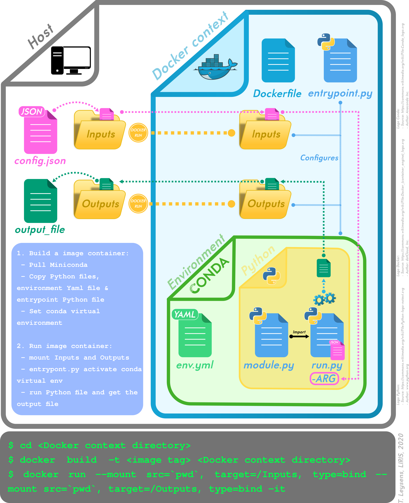

> ***Disclaimer: these dockers use the [geodecision decision making-tools Python package](https://github.com/VCityTeam/UD-geodecision)***

# Docker a process
In order to easily share and deploy our applications and processes, we use [Docker](https://www.docker.com/).

Working with geospatial libraries (*like [geopandas](http://geopandas.org/)*) under Python could be problematic if they are not correctly installed.

That's why we use the [Conda](https://conda.io/en/latest/) environnement to install them and create virtual environnement. For more explanations about it, see the [warnings in the geodecision readme](https://github.com/VCityTeam/UD-geodecision#warningsdisclaimer). 

## Needs
> To illustrate the process, we have created a DockerContext example: [TestGetParks_DockerContext](./TestGetParks_DockerContext).
> Python methods makes some requests on OpenStreetMap using parameters set in a config.json file.  

To set our docker, we need:
* [Miniconda Python 3 image](https://hub.docker.com/r/continuumio/miniconda3) on DockerHub (*continuumio/miniconda3*) => get it from [DockerHub](https://hub.docker.com/) via the ```FROM``` command in the Dockerfile
* a conda virtual environnement (*usually it is not required as we already run our Python modules inside a Docker container but we prefer to proceed this way in order to make the development and debugging  easier for the developers*) that will be set via a [YAML file]((./TestGetParks_DockerContext/env.yml)). For details, you can check documentation [here](https://docs.conda.io/projects/conda/en/latest/user-guide/tasks/manage-environments.html#creating-an-environment-from-an-environment-yml-file) and [here](https://docs.conda.io/projects/conda/en/latest/user-guide/tasks/manage-environments.html#create-env-file-manually):
    ```yaml
    name: osm_query_env
    channels:
      - defaults
      - conda-forge
    dependencies:
      - geojson=2.4.1
      - geopandas=0.6.0
      - pip:
          - overpass==0.6.1
    ```
* Python modules and JSON parameters:
    * [***run.py***](./TestGetParks_DockerContext/run.py)
    * [***methods.py***](./TestGetParks_DockerContext/methods.py)
    * [***config.json***](./TestGetParks_DockerContext/config.json)
* A Python [entrypoint](./TestGetParks_DockerContext/entrypoint.py) to run our Docker and set the inputs and outputs (*see the figure for more details*):
    ```python
    import subprocess
    import json
    import os
    import shutil

    subprocess.call(["conda", "run", "-n", "osm_query_env", "python", "run.py", "/Input/config.json"])

    json_config=os.path.join('/Input', 'config.json')
    with open(json_config) as f:
       params = json.load(f)
       output_file = params["output_file"]
       target_output_file = os.path.join('/Output', output_file)
    if os.path.isfile(output_file):
       shutil.copyfile(output_file, target_output_file)
    ```
* And of course a [Dockerfile]((./TestGetParks_DockerContext/Dockerfile)):
    ```
    # Get Miniconda (Anaconda Python) from Docker Hub
    # (https://hub.docker.com/r/continuumio/miniconda3)
    FROM continuumio/miniconda3

    # Create conda virtual environment
    # (see:
    #     - https://docs.conda.io/projects/conda/en/latest/user-guide/tasks/manage-environments.html#creating-an-environment-from-an-environment-yml-file
    #     - https://docs.conda.io/projects/conda/en/latest/user-guide/tasks/manage-environments.html#create-env-file-manually
    #     - https://pythonspeed.com/articles/activate-conda-dockerfile/)
    COPY env.yml .
    RUN conda env create -f env.yml

    # The code to run when container is started:
    COPY run.py .
    COPY entrypoint.py .
    COPY methods.py .
    ENTRYPOINT ["python", "/entrypoint.py"]
    ```

## Process
### Illustration


### Building and running instructions: the shell way
The docker build process requires access to the [UD-geodecision github repository](https://github.com/VCityTeam/UD-geodecision).
In order to transmit such credentials to the building process you should
first [create a personnal access token](https://help.github.com/en/github/authenticating-to-github/creating-a-personal-access-token-for-the-command-line) (referenced as `TOKEN` below).

Note that when required to [specify the token scopes](https://help.github.com/en/github/authenticating-to-github/creating-a-personal-access-token-for-the-command-line) you apprently need to select `repo` in order to allow for cloning.

Once you have a `TOKEN` launch the following command:
```bash
docker build --build-arg git_token=<TOKEN> -t liris/geodecision DockerContext
```
You can now run the container with
```bash
docker run --mount src=`pwd`,target=/Input,type=bind --mount src=`pwd`,target=/Output,type=bind --rm -it liris/geodecision
```
The outputs are placed in `data/outputs` subdirectory.

### Developer's notes
 * In order to debug the build container use
   ```bash
   docker run --entrypoint /bin/bash -it liris/geodecision
   ```
